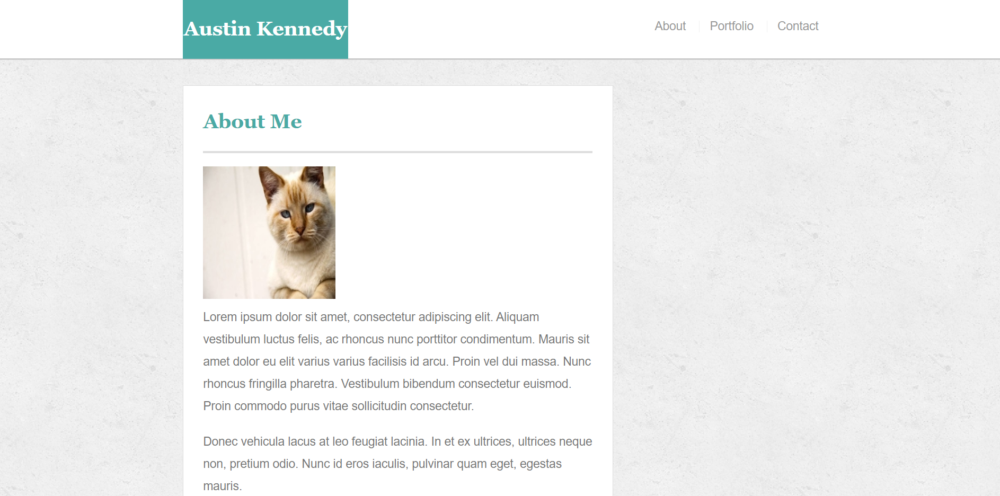
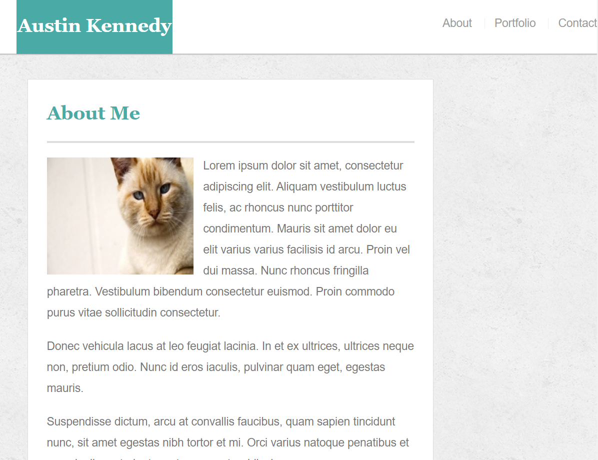
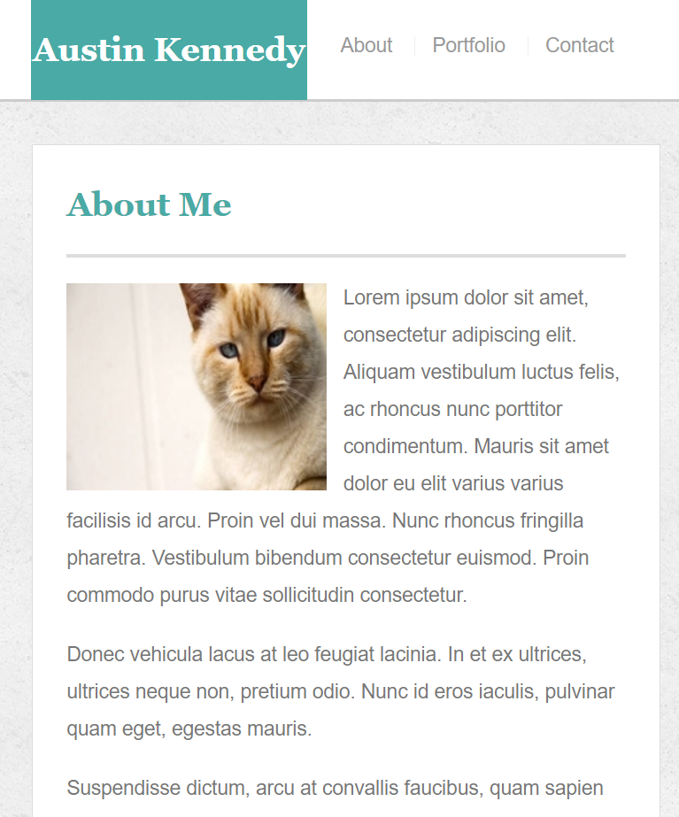
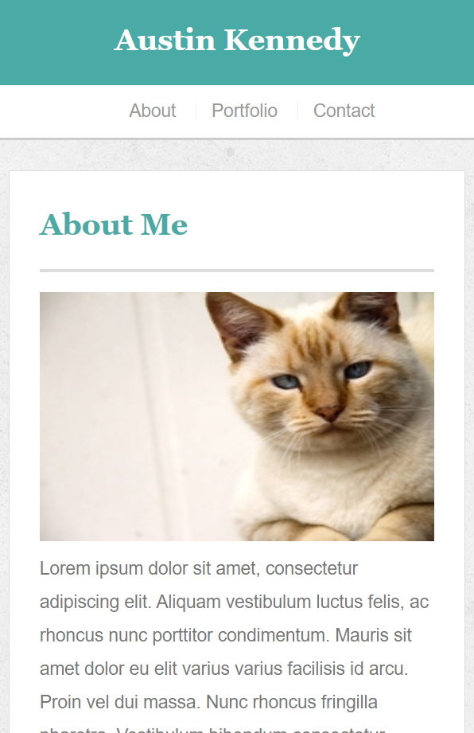

# Responsive-Portfolio

Project Link:
https://kennedyaustin.github.io/Responsive-Portfolio/

# Project Description
The concept of this project was to change the information on the page as the screen size changed.

# Approach
For this project no bootstrap was implemented, so the use of media queries was required. Using media queries at different min and max screen width values, I changed the size of the information boxes to fit the page.

# Tools Used
● CSS  
● HTML

# Screen Sizes 
● large: > 980px wide  

● medium: 769px - 980px wide  

● small: 641px - 768px wide  

● x-small: <= 640px wide  

